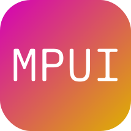

# MPUI
_At some point, you need to bake your own bread._

```rust
use mpui::ui::{MWindow, MText};
use mpui::types::{MColor};

fn main() {
    let mut window = MWindow::new();
    window.set_title("MPUI Window".to_string());
    window.set_background_color(MColor::from_hex("#ffffff".to_string()));

    let mut text = MText::new();
    text.set_text("Hello, World!".to_string());

    window.set_primary_widget(text);
    window.show();
}
```

We created MPUI because Rust needs an end-all, cross-platform, GPU-accelerated, desktop UI framework.

## Overview

> **All one language**

MPUI user interfaces can be created all in native rust. No macros, no extra ui-related files, it's all purely one language.

> **Huge library**

MPUI not only includes a widget for that one specific thing (`mpui::ui`), it includes types (`mpui::types`) for various tools too! Colors, fonts, threading, and more can be used.

## Steps
As of right now, MPUI is under active development. Below is our roadmap to final release:

- [ ] Basic window rendering and creation (MWindow)
- [ ] Basic widget and layout engine (MWidget, MLayout)
- [ ] Widget rendering (MRenderer)
